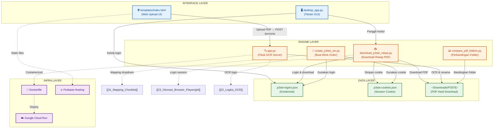
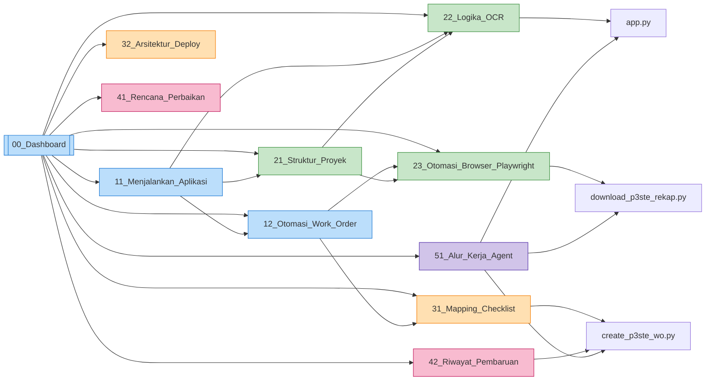

# 🗂️ Dashboard Project: Ganti Nama App & Otomasi P3-STE

Selamat datang di Obsidian Vault untuk **Ganti Nama App & Otomasi P3-STE**. Vault ini dirancang untuk mendokumentasikan alur kerja, arsitektur kode, aturan bisnis, serta melacak perkembangan pengerjaan proyek.

#dashboard #index #MOC

---

## 🗺️ Peta Navigasi (Map of Content)

### 🚀 1. Panduan Penggunaan
*   [[11_Menjalankan_Aplikasi|🏃 Panduan Menjalankan Aplikasi]] — Langkah-langkah menjalankan script utama, Flask OCR, serta aplikasi desktop (GUI).
*   [[12_Otomasi_Work_Order|🤖 Alur Otomasi Work Order]] — Panduan detail penggunaan `create_p3ste_wo.py`, format input, pencocokan text (matching logic), dan mode pengujian.

### 📐 2. Arsitektur Kode & Sistem
*   [[21_Struktur_Proyek|📂 Struktur Folder & Komponen]] — Penjelasan peran setiap file utama (`app.py`, `desktop_app.py`, dll.) dalam proyek.
*   [[22_Logika_OCR|🔍 Cara Kerja OCR & Ekstraksi PDF]] — Logika pemotongan area (cropping), pemanfaatan Tesseract OCR, dan pencocokan pola regex.
*   [[23_Otomasi_Browser_Playwright|🌐 Otomasi Browser & Login Session]] — Detail implementasi Playwright, manajemen profil `.p3ste-browser`, dan penyimpanan data login.

### 📚 3. Basis Pengetahuan (Knowledge Base)
*   [[31_Mapping_Checklist|📋 Pemetaan Kode & Kategori Checklist]] — Referensi mapping tipe checklist, kategori, periode, dan kode checklist (Wesel, Sinyal, AXC).
*   [[32_Arsitektur_Deploy|🚀 Pipeline Deployment]] — Dokumentasi Docker, Cloud Run, Firebase Hosting, dan alur deploy 1-klik.

### 📋 4. Rencana Kerja & Riwayat
*   [[41_Rencana_Perbaikan|🛠️ Daftar Rencana Perbaikan]] — Todo list perbaikan aplikasi, prioritas fitur, dan area perbaikan saat ini.
*   [[42_Riwayat_Pembaruan|📜 Riwayat Pembaruan Script WO]] — Catatan tahapan perkembangan implementasi script pembuatan Work Order.

### 🤖 5. Alur Kerja Agent & Otomasi
*   [[51_Alur_Kerja_Agent|🧠 Alur Kerja Agent]] — Penjelasan bagaimana script-agent mengorkestrasi seluruh pipeline otomatisasi P3-STE.

---

## 🔄 Alur Kerja Ekosistem (End-to-End)

---

## 📊 Keterkaitan Antar Note

---

## 🏷️ Tag Index

| Tag | Keterangan |
|-----|------------|
| `#dashboard` | Halaman index utama |
| `#panduan` | Panduan penggunaan |
| `#arsitektur` | Dokumentasi arsitektur kode |
| `#knowledge` | Basis pengetahuan & referensi |
| `#task` | Rencana & riwayat pekerjaan |
| `#agent` | Alur kerja agent & otomasi |
| `#ocr` | Terkait OCR & ekstraksi PDF |
| `#playwright` | Terkait Playwright & browser automation |
| `#deploy` | Terkait deployment & infrastruktur |

---

💡 **Tips Obsidian:**
- Gunakan shortcut `Ctrl + Click` (Windows) pada tautan wikilink untuk langsung membuka note.
- Tekan `Ctrl + P` untuk membuka Command Palette dan cari note dengan cepat.
- Buka **Graph View** (`Ctrl + G`) untuk melihat peta keterkaitan seluruh note secara visual.
- Gunakan **Tag Pane** untuk navigasi berdasarkan kategori.
