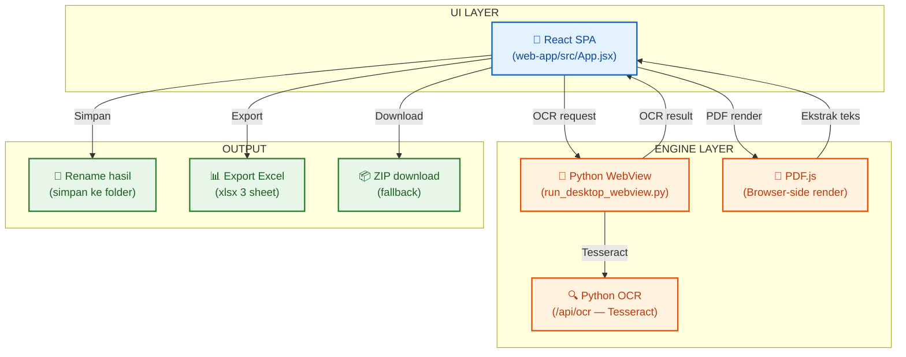

# 🗂️ Dashboard: Sintelis Utility

Vault dokumentasi untuk **Sintelis Utility** — aplikasi desktop untuk OCR & rename file PDF ceklis sintelis.

#dashboard #index #MOC

---

## 🗺️ Peta Navigasi

### 🚀 1. Panduan Penggunaan
- [[11_Menjalankan_Aplikasi|🏃 Menjalankan Aplikasi]] — cara pakai `SintelisUtility.exe` atau `run_desktop_webview.py`

### 📐 2. Arsitektur Kode
- [[21_Struktur_Proyek|📂 Struktur Proyek]] — penjelasan `web-app/`, React SPA, Python WebView backend
- [[22_Logika_OCR|🔍 Logika OCR]] — alur OCR & deteksi dokumen (15 branch `detectDoc()`)

### 📚 3. Basis Pengetahuan
- [[31_Mapping_Checklist|📋 Pemetaan Kode & Kategori]] — mapping kode checklist, kategori, periode (Wesel, Sinyal, AXC, dll)
- [[33_Data_Aset_Referensi|📊 Data Aset Referensi]] — data aset resmi UPT Resor Sintelis 1.21 BOO (372 aset)
- [[34_Sintelis_Utility|📦 Sintelis Utility]] — ringkasan proyek, fitur, struktur file, build instruction
- [[35_Aturan_Serat_Optik_OTB|🔬 Aturan SO OTB]] — aturan lengkap deteksi ER SINYAL/ER TELKOM/ER RADIO & range OTB

### 📋 4. Task & Log
- [[41_Rencana_Perbaikan|🛠️ Rencana Perbaikan]] — todo list & prioritas fitur
- [[42_Riwayat_Pembaruan|📜 Riwayat Pembaruan]] — changelog tahapan development
- [[43_Temuan_dan_Rencana_Perbaikan_v2|🐛 Temuan & Fix Batch 2]] — bug regex, lokasi per aset (semua fixed ✅)
- [[44_Temuan_dan_Rencana_Perbaikan_v3|🐛 Temuan & Fix Batch 3]] — validasi DATA ASET RESOR 2026
- [[45_Handover_PC_Kantor|💻 Handover PC Kantor]] — catatan setup & handover perangkat
- [[46_Temuan_dan_Fix_Batch_5|🐛 Temuan & Fix Batch 5]] — blank minimize, cancel stuck, PDSE/PTDS/PTLS, PTPP JPL

---

## 🔄 Arsitektur Aplikasi (End-to-End)

---

## 🏷️ Tag Index

| Tag | Keterangan |
|-----|------------|
| `#dashboard` | Halaman index utama |
| `#panduan` | Panduan penggunaan |
| `#arsitektur` | Dokumentasi arsitektur kode |
| `#knowledge` | Basis pengetahuan & referensi |
| `#task` | Rencana & riwayat pekerjaan |
| `#ocr` | Terkait OCR & ekstraksi PDF |
| `#serat-optik` | ER SINYAL / ER TELKOM / ER RADIO |
| `#proyek` | Ringkasan proyek & build |
| `#referensi` | Data referensi & mapping |
| `#changelog` | Riwayat perubahan |
| `#handover` | Catatan handover & setup |

---

💡 **Tips Obsidian:**
- `Ctrl + Click` pada wikilink untuk buka note.
- `Ctrl + P` → Command Palette untuk cari note cepat.
- `Ctrl + G` → Graph View untuk lihat peta keterkaitan note.
