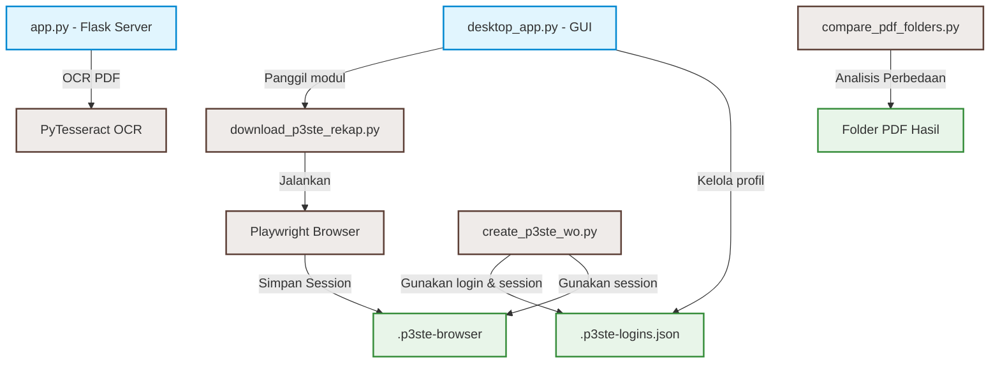

# 🗂️ Dashboard Project: Ganti Nama App & Otomasi P3-STE

Selamat datang di Obsidian Vault untuk **Ganti Nama App & Otomasi P3-STE**. Vault ini dirancang untuk mendokumentasikan alur kerja, arsitektur kode, aturan bisnis, serta melacak perkembangan pengerjaan proyek.

---

## 🗺️ Peta Navigasi (Map of Content)

### 🚀 1. Panduan Penggunaan
*   [[11_Menjalankan_Aplikasi|🏃 Panduan Menjalankan Aplikasi]] — Langkah-langkah menjalankan script utama, Flask OCR, serta aplikasi desktop (GUI).
*   [[12_Otomasi_Work_Order|🤖 Alur Otomasi Work Order]] — Panduan detail penggunaan `create_p3ste_wo.py`, format input, pencocokan text (matching logic), dan mode pengujian.

### 📐 2. Arsitektur Kode & Sistem
*   [[21_Struktur_Proyek|📂 Struktur Folder & Komponen]] — Penjelasan peran setiap file utama (`app.py`, `desktop_app.py`, dll.) dalam proyek.
*   [[22_Logika_OCR|🔍 Cara Kerja OCR & Ekstraksi PDF]] — Logika pemotongan area (cropping), pemanfaatan Tesseract OCR, dan pencocokan pola regex.
*   [[23_Otomasi_Browser_Playwright|🌐 Otomasi Browser & Login Session]] — Detail implementasi Playwright, manajemen profil `.p3ste-browser`, dan penyimpanan enkripsi data login.

### 📚 3. Basis Pengetahuan (Knowledge Base)
*   [[31_Mapping_Checklist|📋 Pemetaan Kode & Kategori Checklist]] — Referensi mapping tipe checklist, kategori, periode, dan kode checklist (Wesel, Sinyal, AXC).

### 📋 4. Rencana Kerja & Riwayat
*   [[41_Rencana_Perbaikan|🛠️ Daftar Rencana Perbaikan]] — Todo list perbaikan aplikasi, prioritas fitur, dan area perbaikan saat ini.
*   [[42_Riwayat_Pembaruan|📜 Riwayat Pembaruan Script WO]] — Catatan tahapan perkembangan implementasi script pembuatan Work Order.

---

## 📊 Keterkaitan Komponen Utama

---
💡 **Tips Obsidian:** 
- Gunakan shortcut `Ctrl + Click` (Windows) pada tautan di atas untuk langsung membuka note tersebut.
- Tekan `Ctrl + P` untuk membuka Command Palette dan cari note dengan cepat.
