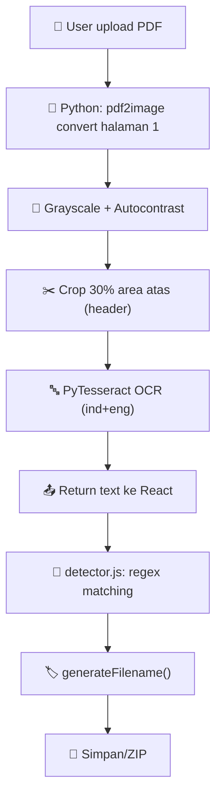

# 🔍 Cara Kerja OCR & Ekstraksi PDF

#arsitektur #ocr

> [!tip] Kembali ke [[00_Dashboard|Dashboard Utama]]

Sintelis Utility menggunakan **dual-layer OCR**: OCR engine Python (Tesseract via `run_desktop_webview.py`) untuk ekstraksi teks, lalu React-side `detector.js` untuk deteksi tipe dokumen dan rename.

---

## 🛠️ Alur Pemrosesan Dokumen



---

## 💻 Detail Implementasi

### 1. Layer Python: Ekstraksi Teks (`run_desktop_webview.py`)
API endpoint `/api/ocr` menerima file PDF:

```python
# run_desktop_webview.py — /api/ocr endpoint
images = convert_from_bytes(file_bytes, dpi=150, first_page=1, last_page=1)
img = images[0].convert('L')  # Grayscale
img = ImageOps.autocontrast(img)

# Crop header area (30% atas)
w, h = img.size
img_cropped = img.crop((0, 0, w, h * 0.30))

# OCR dengan Tesseract
text = pytesseract.image_to_string(img_cropped, lang='ind+eng')
```

- **DPI 150**: Keseimbangan kecepatan vs akurasi
- **Halaman 1 saja**: Header dokumen selalu di halaman pertama
- **Crop 30% atas**: Lokasi header (stasiun, kode aset, tipe checklist)
- **Autocontrast**: Menormalkan kualitas scan yang bervariasi

### 2. Layer React: Deteksi Dokumen (`detector.js`)
Hasil teks dari OCR dicocokkan menggunakan regex dan keyword matching:

**Daftar Branch `detectDoc()` (Gerbang A — OCR-based)**:
Urutan branch menentukan prioritas deteksi. Branch pertama yang match akan dieksekusi.

| # | Keyword Match | Kode | Kategori | Ekstraksi Aset |
|---|--------------|------|----------|----------------|
| 1 | `PERAWATAN WESEL` / `PENGGERAK WESEL` | `BPBYE1` | WESEL | Regex `W{n}{suffix}` per baris |
| 2 | `POINT LOCK` / `PENGAMAN WESEL` | `BPBYE1` | WESEL | Sama dengan #1 |
| 3 | `PERALATAN DALAM PERSINYALAN ELEKTRIK` | `BPBYE2` | PDSE | Single asset, loc dari OCR |
| 4 | `SERAT OPTIK` + `JPL` | `BPBKF4` | SERAT OPTIK | Ekstrak JPL per baris |
| 5 | `SERAT OPTIK` + `ER` | `BPBKF4` | SERAT OPTIK | Parse TRA lines → ER/ER TELKOM |
| 6 | `TELEKOMUNIKASI DI PINTU PERLINTASAN` | — | PTLP | `extractJPLAssets()` |
| 7 | `PINTU PERLINTASAN` | `BPBKS17` | PINTU PERLINTASAN | `extractJPLAssets(multiWord=true)` |
| 8 | `TELEKOMUNIKASI DI STASIUN` | `BPBKS15` | PTDS | Single asset |
| 9 | `TELEKOMUNIKASI DI LUAR STASIUN` | `BPBKS16` | PTLS | Parsing lokasi dari LOKASI field |
| 10 | `RADIO BASESTATION` | `BPBKF1/2/3` | RADIO BASESTATION | Sub-tipe: Tait/Digital/standar |
| 11 | `SISTEM WAYSTATION` / `RADIO WAYSTATION` | `BPBKS5/16` | WAYSTATION | Multi-asset TLK parsing |
| 12 | `CTC` + `CTS` | `BPBYE4` | CTC-CTS | Single asset |
| 13 | `CATU DAYA` | `BPBYE14` | CATU DAYA | Single asset |
| 14 | `PERAWATAN AXLE COUNTER` | `BPBYE7` | AXLE COUNTER | Regex `ZP{n}{suffix}` per baris |
| 15 | `PERAGA SINYAL` | `BPBYE3` | PERAGA SINYAL | Regex signal code per baris |

**Gerbang B (Fallback Filename-based)**:
Jika Gerbang A tidak menghasilkan aset, deteksi fallback dari nama file menggunakan keyword yang sama.

### 3. Format Rename Output
- **BTP JAK**: `{JENIS} {KATEGORI} {ID} {LOKASI} {TANGGAL}.pdf`
- **BTP BD (KHUSUS SINTEL BOO)**: `{PERIODE}_{RESOR}_{KODE}_{JENIS}_{IDENTITAS}_{TANGGAL}.pdf`

---

## 🔄 Koneksi Antar Note

- [[21_Struktur_Proyek]] — Struktur project & peran komponen
- [[35_Aturan_Serat_Optik_OTB]] — Aturan lengkap SO OTB
- [[31_Mapping_Checklist]] — Pemetaan kode checklist
- [[11_Menjalankan_Aplikasi]] — Cara menjalankan
- [[00_Dashboard|Kembali ke Dashboard]]
