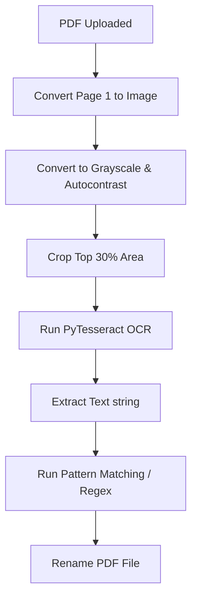

# 🔍 Cara Kerja OCR & Ekstraksi PDF (`app.py`)

Aplikasi `app.py` menggunakan teknologi OCR (Optical Character Recognition) untuk mendeteksi data teks di dalam PDF hasil scan, guna mengenali jenis dokumen dan menamainya kembali secara terstruktur.

---

## 🛠️ Alur Pemrosesan Dokumen

Proses pengolahan PDF di dalam `app.py` mengikuti alur pipeline berikut:



---

## 💻 Detail Implementasi Langkah-Langkah

### 1. Konversi Halaman PDF ke Gambar
Pemeriksaan P3-STE biasanya hanya memerlukan data pada lembar pertama dokumen.
*   **Modul**: `pdf2image.convert_from_bytes()`
*   **Resolusi**: `dpi=150` (keseimbangan optimal antara kecepatan proses dan keakuratan OCR).
*   **Rentang Halaman**: `first_page=1, last_page=1` (hanya mengambil halaman pertama).

```python
# Potongan kode implementasi
images = convert_from_bytes(file_bytes, dpi=150, first_page=1, last_page=1)
img = images[0].convert('L') # Ubah ke grayscale (L) untuk meningkatkan kontras OCR
```

### 2. Autocontrast & Cropping Area
Kualitas scan dokumen di lapangan bisa sangat bervariasi.
*   **Autocontrast**: `ImageOps.autocontrast(img)` digunakan untuk menyeimbangkan histogram warna abu-abu agar text hitam terlihat tajam dan background putih bersih.
*   **Cropping**: Kunci penting kecepatan dan keakuratan OCR proyek ini adalah pemotongan area (cropping). Bagian header dokumen (yang memuat stasiun, kode asset, dan tipe checklist) hanya berada di bagian atas halaman.
    *   Lebar dipotong penuh: `width * 1.0`
    *   Tinggi dipotong hanya bagian atas: `height * 0.30` (30% teratas)

```python
img_cropped = img.crop((0.0, 0.0, width * 1.0, height * 0.30))
text_crop = pytesseract.image_to_string(img_cropped, lang='ind+eng').upper()
```

### 3. Deteksi Dokumen & Ekstraksi Metadata (`detect_doc()`)
Hasil teks dari OCR (`text_crop`) kemudian dicocokkan menggunakan regex dan pencarian kata kunci:

*   **Pola Deteksi Sinyal**:
    ```python
    SIGNAL_PATTERN = re.compile(r'\b([BJLMSXU]+\.?\s?\d{1,3}[A-Z]?)\b')
    ```
    Pola ini mendeteksi kode sinyal khas kereta api seperti `J.10`, `JL92`, `S14`, dll.

*   **Pengelompokan Lokasi**:
    *   **BTP Jakarta** (`BTP_JAK_LOCS`): `"BOO"`, `"CLT"` (Bogor, Cilebut).
    *   **BTP Bandung** (`BTP_BD_LOCS`): `"BOP"`, `"BTT"`, `"COS"`, `"MSG"`, `"CGB"`.

*   **Renaming Logic**:
    Setelah kode asset, stasiun, dan kategori teridentifikasi, file PDF akan dinamai ulang dengan format standar yang mudah dibaca oleh sistem rekap dan manusia.
