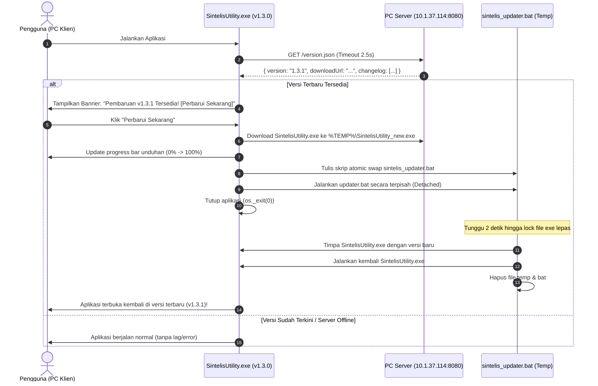

# 🚀 Rencana Sistem Auto-Update Berbasis PC Server (10.1.37.114)

#task #arsitektur #rencana #autoupdate

> [!tip] Kembali ke [[00_Dashboard|Dashboard Utama]]

Dokumen ini berisi cetak biru teknis untuk implementasi sistem **Pembaruan Otomatis (Auto-Updater)** aplikasi desktop **Sintelis Utility** (`SintelisUtility.exe`) yang terhubung ke **PC Server Kantor (IP: `10.1.37.114`)**.

---

## 🎯 Tujuan & Latar Belakang

1. **Aplikasi Berjalan Mandiri di Setiap PC**: Pengguna tetap menjalankan aplikasi sebagai desktop executable (`SintelisUtility.exe`) portabel di PC masing-masing (bukan via browser), sehingga pemrosesan OCR tetap cepat dan mandiri.
2. **Otomasi Pembaruan Terpusat**: Saat ada perbaikan atau fitur baru, admin cukup meletakkan file rilis terbaru di PC Server kantor (`10.1.37.114`). Seluruh PC pengguna akan mendeteksi dan memperbarui aplikasi secara otomatis saat dibuka.
3. **Bebas Blokir Firewall Kantor**: Traffic berada 100% di dalam jaringan lokal (intranet kantor/LAN), sehingga tidak bergantung pada domain eksternal dan tidak dapat diblokir oleh firewall internet kantor.
4. **Kecepatan Tinggi**: File `.exe` (~214 MB) terunduh dalam waktu 3–8 detik melalui jaringan lokal.

---

## 🏗️ Arsitektur Alur Update (Atomic Swap)



---

## 📦 Komponen Teknis

### 1. Sisi PC Server (`10.1.37.114:8080`)
Folder di PC Server: `C:\Sintelis_Update_Server\`
* **`version.json`**:
  ```json
  {
    "version": "1.3.1",
    "releaseDate": "2026-09-12",
    "downloadUrl": "http://10.1.37.114:8080/SintelisUtility.exe",
    "fileSize": 214396529,
    "changelog": [
      "Perbaikan deteksi multi-JPL (JPL 07 & JPL BNR)",
      "Optimalisasi Level 1 Binary Deduplication",
      "Akselerasi simpan file 10x lebih cepat"
    ]
  }
  ```
* **`SintelisUtility.exe`**: File binary rilis terbaru.
* **`server_update.py` & `start_server.bat`**:
  - Server HTTP ringan berbasis Python standard library (`ThreadingHTTPServer`).
  - Mendukung header CORS (`Access-Control-Allow-Origin: *`) dan HTTP Range header.
  - Startup 1-klik via `start_server.bat`.

### 2. Sisi Klien Desktop (`web-app/run_desktop_webview.py`)
* **`APP_VERSION = "1.3.0"`**: Konstanta versi lokal.
* **API Endpoints**:
  * `GET /api/update/check?server={url}`: Pengecekan versi remote vs lokal.
  * `POST /api/update/download`: Unduh file chunk streaming ke `%TEMP%` dengan progress tracking.
  * `POST /api/update/apply`: Eksekusi `sintelis_updater.bat` detached dan terminate aplikasi.

### 3. Sisi Antarmuka UI React (`web-app/src/`)
* **`UpdateBanner.jsx`**: Notifikasi elegan di bagian atas layar jika update tersedia.
* **`UpdateModal.jsx`**: Dialog modal changelog, bilah progres download real-time, dan status restart.
* **Pengaturan Alamat Server**: Opsi setting alamat server update (default: `http://10.1.37.114:8080`) tersimpan di `localStorage`.

---

## 📋 Langkah Rilis Versi Baru (Untuk Admin)

Setiap kali ada update aplikasi:
1. Jalankan `npm run build` dan `pyinstaller build_exe.spec` di PC pengembang.
2. Salin `SintelisUtility.exe` hasil build ke folder server `C:\Sintelis_Update_Server\`.
3. Perbarui nomor versi dan changelog di `version.json`.
4. Selesai! Semua PC pengguna yang membuka aplikasi akan otomatis menerima notifikasi dan memperbarui aplikasinya.

---

## 🔄 Koneksi Antar Note

- [[00_Dashboard|Dashboard Utama]]
- [[41_Rencana_Perbaikan|Daftar Rencana Perbaikan]]
- [[42_Riwayat_Pembaruan|Riwayat Pembaruan]]
- [[47_Temuan_dan_Fix_Batch_6|Catatan Pembaruan Batch 6]]
