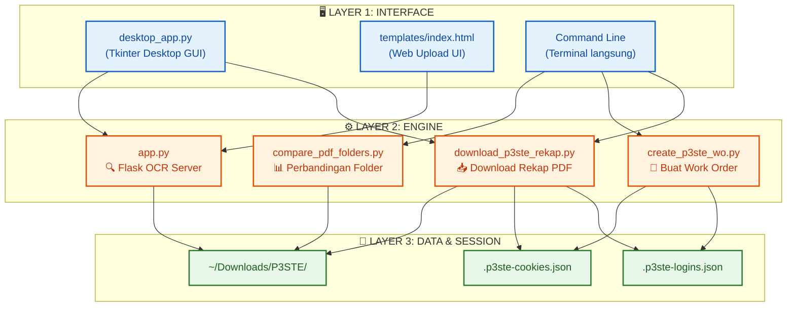
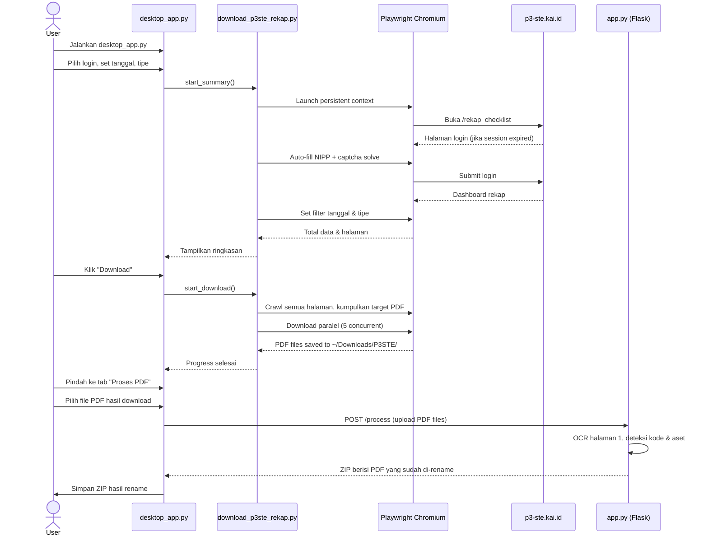
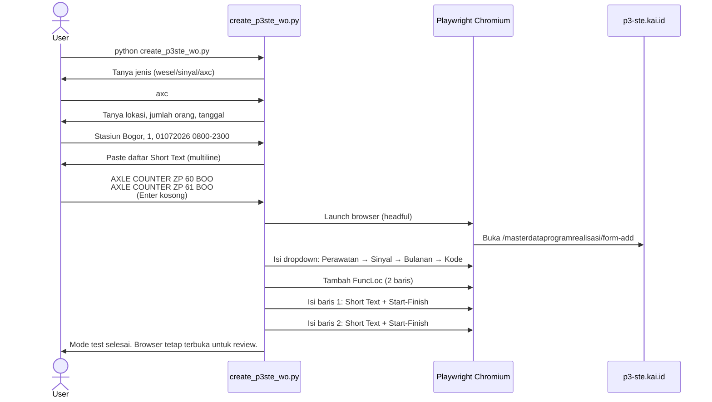
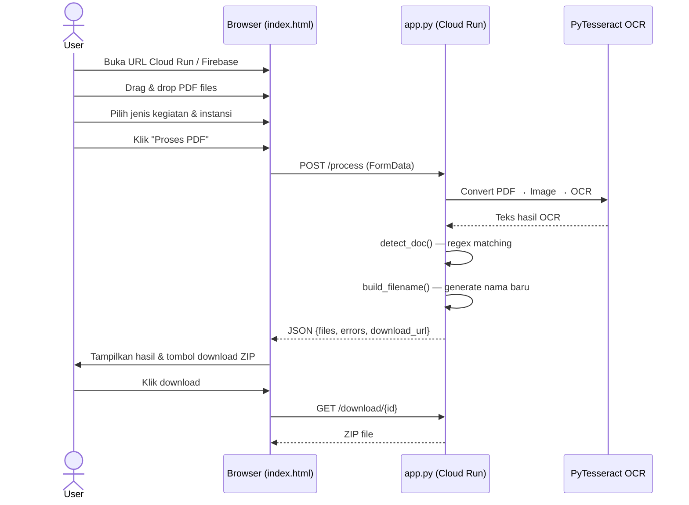

# 🧠 Alur Kerja Agent

Note ini mendokumentasikan bagaimana **seluruh script** dalam proyek ini saling terhubung dan bekerja sebagai satu ekosistem otomatisasi yang utuh. Setiap script memiliki peran spesifik dan dapat dipanggil secara independen maupun berurutan.

#agent #arsitektur

> [!tip] Kembali ke [[00_Dashboard|Dashboard Utama]]

---

## 🏗️ Tiga Lapisan Ekosistem

---

## 📋 Alur Kerja Per Scenario

### Scenario 1: Download & Rename PDF Ceklis

Alur paling umum dipakai sehari-hari — download rekap dari P3-STE lalu rename hasilnya.

### Scenario 2: Buat Work Order Otomatis

Alur untuk mengisi form Program Realisasi di P3-STE secara massal.

### Scenario 3: Upload PDF ke Web (Rename via Browser)

Alur ketika user mengakses web UI untuk upload PDF dan download hasil rename.

---

## 🔗 Dependency Antar Script

| Script | Depends On | Shared Data |
|--------|-----------|-------------|
| `desktop_app.py` | `download_p3ste_rekap.py` (import modul) | `.p3ste-logins.json` |
| `create_p3ste_wo.py` | `download_p3ste_rekap.py` (reuse login, browser, base URL) | `.p3ste-logins.json`, `.p3ste-cookies.json` |
| `app.py` | `pytesseract`, `pdf2image` (independen) | File PDF upload |
| `compare_pdf_folders.py` | Tidak ada (independen) | Folder PDF lokal |
| `download_p3ste_rekap.py` | `playwright` (independen) | `.p3ste-logins.json`, `.p3ste-cookies.json` |

> [!note] Modul Inti
> `download_p3ste_rekap.py` adalah **modul inti** yang di-reuse oleh `desktop_app.py` dan `create_p3ste_wo.py`. Fungsi login, cookie management, dan browser context didefinisikan di sini dan di-import oleh modul lain.

---

## 🔄 Koneksi Antar Note

- [[21_Struktur_Proyek]] — Detail peran setiap file
- [[22_Logika_OCR]] — Alur OCR di `app.py`
- [[23_Otomasi_Browser_Playwright]] — Detail Playwright session
- [[12_Otomasi_Work_Order]] — Panduan input WO
- [[31_Mapping_Checklist]] — Mapping dropdown WO
- [[32_Arsitektur_Deploy]] — Pipeline deployment
- [[00_Dashboard|Kembali ke Dashboard]]
