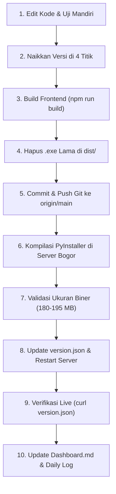

# 📋 ATURAN & STANDAR OPERASIONAL PROSEDUR (SOP) UPDATE APP
## Sintelis Utility Desktop (`SintelisUtility.exe`)

> **DOKUMEN WAJIB**: Setiap AI Agent atau pengembang yang akan melakukan perubahan kode, pembaruan, kompilasi, atau rilis biner aplikasi **HARUS** membaca dan mengikuti seluruh langkah dalam dokumen ini secara berurutan tanpa ada yang dilewati.

---

## 🛑 6 Aturan Emas (Golden Rules)

1. **Aturan Versi (Versi Wajib Selalu Naik)**:
   - Setiap rilis baru **WAJIB** menaikkan nomor versi (*SemVer: Major.Minor.Patch*, contoh: `1.5.3` ➔ `1.5.4`).
   - Nomor versi harus sinkron di **4 titik lokasi** secara serentak. Tidak boleh ada satu pun yang tertinggal.
2. **Aturan Kebersihan Biner (Anti-Bloatware / Anti-Sampah)**:
   - **DILARANG KERAS** memaketkan sisa file `.exe` lama, folder sementara, file log, file hasil uji coba, dataset, atau model AI yang tidak dipakai ke dalam file kompilasi.
   - Direktori `dist/` wajib dibersihkan dari file executable lama sebelum PyInstaller dijalankan agar tidak terjadi *recursive packaging*.
3. **Aturan Batas Ukuran Biner (Size Guardrail)**:
   - Ukuran normal biner `SintelisUtility.exe` adalah **~180 MB – 195 MB**.
   - Jika ukuran hasil kompilasi melonjak di atas **250 MB** (apalagi hingga 500 MB atau 1 GB), **PROSES RILIS WAJIB DIBATALKAN**. Ini indikasi pasti adanya file `.exe` lama atau folder sampah yang ikut terbungkus.
4. **Aturan Build Frontend Sebelum Kompilasi**:
   - Skrip `npm run build` wajib dijalankan di direktori `web-app/` dan diverifikasi menghasilkan **0 error** sebelum biner Python dikompilasi.
5. **Aturan Verifikasi Live**:
   - Setelah rilis di server, endpoint publik `https://update.sintelboo.my.id/version.json` wajib dites menggunakan `curl` dan harus mengembalikan status **HTTP 200** dengan nomor versi, ukuran berkas, dan changelog yang sesuai.
6. **Aturan Dokumentasi**:
   - Setiap update wajib dicatat changelog-nya di `Dashboard.md` dan daily log `Notes/Daily/YYYY-MM-DD.md`.

---

## 🎯 4 Titik Sinkronisasi Nomor Versi (Wajib Diperbarui Serentak)

| No | File Lokasi | Variabel / Baris Target | Contoh |
| :---: | :--- | :--- | :--- |
| **1** | `web-app/updater_engine.py` | `APP_VERSION = "..."` | `APP_VERSION = "1.5.4"` |
| **2** | `web-app/run_desktop_webview.py` | `webview.create_window("Sintelis Utility 2.0 (v...)", ...)` | `(v1.5.4)` |
| **3** | `web-app/src/components/Sidebar.jsx` & `BentoHeader.jsx` | `appVersion = "v..."` & `currentVersion = "v..."` | `v1.5.4` |
| **4** | Server `D:\Sintelis_Update_Server\version.json` | `"version": "..."` dan `"downloadUrl": "...?v=..."` | `"version": "1.5.4"` |

---

## 🚫 Daftar Berkas & Folder yang DILARANG Masuk ke Biner (Blacklist)

Saat memaketkan aplikasi menggunakan `build_exe.spec`, pastikan berkas-berkas berikut **TIDAK PERNAH** dimasukkan ke dalam `datas` atau `binaries`:
* ❌ `dist/SintelisUtility.exe` (berkas `.exe` hasil kompilasi sebelumnya).
* ❌ Folder `logs/`, `backups/`, `temp/`, `.cache/`, `.git/`, `.gemini/`.
* ❌ File log dan artefak uji coba (`logs/*.xlsx`, `logs/*.json`, `temp_*.json`).
* ❌ Model bobot AI yang tidak dipakai (`.pt`, `.onnx`, folder YOLO/Vision).
* ❌ Folder `node_modules/` (hanya folder `dist/` hasil `npm run build` yang boleh dibungkus).

---

## 🛡️ Daftar Pustaka Kritis yang Wajib Ada (Whitelist Hidden Imports)

Pastikan file `build_exe.spec` selalu menyertakan pustaka-pustaka ini agar aplikasi tidak crash saat dibuka pengguna:
* ✅ `cryptography` & `pypdf._crypt_providers._cryptography` (wajib untuk dekripsi & pembacaan PDF).
* ✅ `fitz` (PyMuPDF) & `pdfplumber` (ekstraksi teks & tabel PDF).
* ✅ `openpyxl` & `xlsxwriter` (ekspor dokumen Excel Tablo & Dinasan).
* ✅ `PIL` (Pillow) & `numpy` (pemrosesan gambar timemark).
* ✅ `pytesseract` & `pdf2image` (mesin OCR lokal).

---

## 🔄 10 Langkah SOP Update & Rilis Aplikasi



### Langkah 1: Modifikasi Kode & Validasi Lokal
* Terapkan perbaikan fitur atau bug fix.
* Pastikan tidak ada sintaks rusak dan uji fungsionalitas skrip terkait secara lokal.

### Langkah 2: Naikkan Nomor Versi di 4 Titik
* Tentukan versi baru (contoh dari `1.5.3` menjadi `1.5.4`).
* Perbarui `updater_engine.py`, `run_desktop_webview.py`, `Sidebar.jsx`/`BentoHeader.jsx`, dan konfigurasi server `version.json`.

### Langkah 3: Build Frontend Web
* Masuk ke folder `web-app/` lalu jalankan:
  ```powershell
  cd "C:\Users\dikarm\Documents\Server\ganti-nama-app\web-app"
  npm run build
  ```
* Pastikan hasil build berstatus `✓ built in ...ms` dan tidak ada error JSX/TypeScript.

### Langkah 4: Pembersihan Folder `dist/` (Cegah Recursive Packaging)
* Pastikan file `dist/SintelisUtility.exe` lama dihapus sebelum proses pembungkusan:
  ```powershell
  if (Test-Path "web-app\dist\SintelisUtility.exe") { Remove-Item "web-app\dist\SintelisUtility.exe" -Force }
  ```

### Langkah 5: Komit & Push Git ke Repositori Pusat
* Lakukan commit dan push ke cabang utama:
  ```powershell
  git add .
  git commit -m "feat/fix: penjelasan ringkas perubahan (vX.Y.Z)"
  git push origin main
  ```

### Langkah 6: Kompilasi PyInstaller di PC Server Bogor
* Hubungkan SSH ke server update Bogor melalui Cloudflare Tunnel.
* Tarik kode terbaru: `git pull origin main`.
* Jalankan kompilasi bersih:
  ```cmd
  pyinstaller --clean build_exe.spec
  ```

### Langkah 7: Validasi Ukuran Biner (Ukuran Normal: ~180 MB)
* Cek ukuran berkas hasil kompilasi:
  ```powershell
  (Get-Item "web-app\dist\SintelisUtility.exe").Length
  ```
* **Kriteria Kelulusan**:
  * ✅ **180 MB – 195 MB**: Normal dan Lolos Uji.
  * ❌ **> 250 MB**: GAGAL. Hentikan rilis, bersihkan folder `dist/` dan ulangi kompilasi.

### Langkah 8: Salin Biner & Perbarui `version.json`
* Salin biner baru ke folder publik server:
  ```cmd
  copy /y "web-app\dist\SintelisUtility.exe" "D:\Sintelis_Update_Server\SintelisUtility.exe"
  ```
* Tulis payload `version.json` dengan informasi versi baru, tanggal rilis, URL unduh, ukuran berkas dalam bytes, dan poin-poin changelog yang jelas.
* Restart service `server_update.py` via WMI (*Win32_Process*).

### Langkah 9: Verifikasi Live Endpoint Publik
* Jalankan pengecekan HTTP ke endpoint resmi:
  ```powershell
  curl.exe -s "https://update.sintelboo.my.id/version.json"
  ```
* Pastikan field `"version"` sama persis dengan versi baru yang dirilis.

### Langkah 10: Pembaruan Dokumentasi Project
* Tambahkan riwayat pembaruan di `Dashboard.md` (bagian Status Tracker).
* Catat ringkasan pekerjaan di `Notes/Daily/YYYY-MM-DD.md`.

---

## 🛠️ Skrip Otomatisasi Terverifikasi

Gunakan skrip otomatisasi build & rilis yang telah disediakan di:
`C:\Users\dikarm\.gemini\antigravity\brain\f97aeaae-2069-4bcf-93ad-f60871bf29d9\scratch\upload_dist_and_rebuild.py`

Skrip tersebut secara otomatis menjalankan koneksi SSH Cloudflare Tunnel, transfer `dist/` via SFTP, pembersihan `.exe` lama, kompilasi PyInstaller, validasi ukuran biner, penulisan `version.json`, dan restart WMI.
